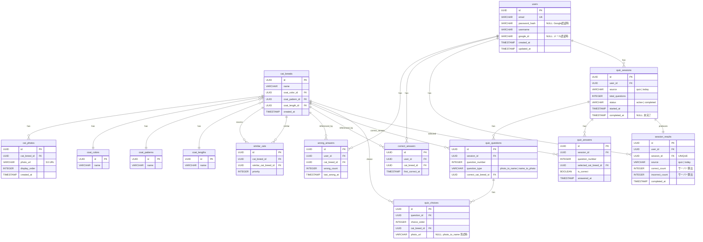

# DB 設計書

## 概要

| 項目 | 内容 |
|------|------|
| プロジェクト | 猫の種類学習アプリ |
| DBエンジン | AWS RDS PostgreSQL |
| 認証方式 | 自前 JWT（httpOnly Cookie）+ Google OAuth 2.0 |
| ファイルストレージ | AWS S3（猫写真）→ DB には URL のみ保持 |
| Read Replica | なし（正規化優先） |
| 設計方針 | UUID 型主キー・created_at / updated_at 標準装備 |

---

## テーブル一覧

| # | テーブル名 | 説明 | 種別 |
|---|-----------|------|------|
| 1 | users | ユーザー情報・認証情報 | トランザクション |
| 2 | cat_breeds | 猫の種類（マスター） | マスター |
| 3 | cat_photos | 猫の写真（S3 URL） | マスター |
| 4 | coat_colors | 毛色マスター | マスター |
| 5 | coat_patterns | 模様マスター | マスター |
| 6 | coat_lengths | 毛の長さマスター | マスター |
| 7 | similar_cats | 類似猫の対応関係（DB トリガーで対称性保証） | マスター |
| 8 | quiz_sessions | クイズセッション管理 | トランザクション |
| 9 | quiz_questions | セッション内の出題問題（サーバー生成・正解保持） | トランザクション |
| 10 | quiz_choices | 各問題の選択肢 | トランザクション |
| 11 | quiz_answers | ユーザーの回答ログ | トランザクション |
| 12 | wrong_answers | 誤答履歴（ユーザーごと・優先出題用） | トランザクション |
| 13 | correct_answers | 正解履歴（ユーザーごと・ユニーク） | トランザクション |
| 14 | session_results | セッション完了結果（サーバー算出） | トランザクション |

---

## ER 図



---

## テーブル詳細

### users（ユーザー）

| カラム名 | 型 | 制約 | 説明 |
|---------|-----|------|------|
| id | UUID | PK, DEFAULT gen_random_uuid() | ユーザーID |
| email | VARCHAR(255) | NOT NULL, UNIQUE | メールアドレス |
| password_hash | VARCHAR(255) | NULL | bcrypt ハッシュ（Google認証時はNULL） |
| username | VARCHAR(50) | NOT NULL | 表示名（2〜20文字） |
| google_id | VARCHAR(255) | NULL, UNIQUE | Google OAuth の sub（メール認証時はNULL） |
| created_at | TIMESTAMP WITH TIME ZONE | NOT NULL, DEFAULT NOW() | 作成日時 |
| updated_at | TIMESTAMP WITH TIME ZONE | NOT NULL, DEFAULT NOW() | 更新日時 |

**インデックス**
```sql
CREATE UNIQUE INDEX idx_users_email ON users(email);
CREATE UNIQUE INDEX idx_users_google_id ON users(google_id) WHERE google_id IS NOT NULL;
```

---

### coat_colors / coat_patterns / coat_lengths（マスター3種）

各マスターは `id UUID PK` + `name VARCHAR(50) NOT NULL` のみ。シードデータとして初期投入。

---

### cat_breeds（猫種）

| カラム名 | 型 | 制約 | 説明 |
|---------|-----|------|------|
| id | UUID | PK, DEFAULT gen_random_uuid() | 猫種ID |
| name | VARCHAR(100) | NOT NULL | 種類名 |
| coat_color_id | UUID | NOT NULL, FK → coat_colors(id) | 毛色（代表色・v1スコープ） |
| coat_pattern_id | UUID | NOT NULL, FK → coat_patterns(id) | 模様（代表・v1スコープ） |
| coat_length_id | UUID | NOT NULL, FK → coat_lengths(id) | 毛の長さ |
| created_at | TIMESTAMP WITH TIME ZONE | NOT NULL, DEFAULT NOW() | 作成日時 |

**v1スコープ補足**：各猫種の代表特徴を1つ保持。「各猫種の代表特徴を識別できる」がv1ゴール。
多値属性（複数毛色など）は v2 で `cat_breed_coat_colors` / `cat_breed_coat_patterns` / `cat_breed_coat_lengths` 中間テーブルを実装する（v2必達）。

**インデックス**
```sql
CREATE INDEX idx_cat_breeds_coat_color ON cat_breeds(coat_color_id);
CREATE INDEX idx_cat_breeds_coat_pattern ON cat_breeds(coat_pattern_id);
CREATE INDEX idx_cat_breeds_coat_length ON cat_breeds(coat_length_id);
```

---

### cat_photos（猫写真）

| カラム名 | 型 | 制約 | 説明 |
|---------|-----|------|------|
| id | UUID | PK, DEFAULT gen_random_uuid() | 写真ID |
| cat_breed_id | UUID | NOT NULL, FK → cat_breeds(id) | 対応する猫種 |
| photo_url | VARCHAR(500) | NOT NULL | CloudFront 経由の URL（S3実体） |
| display_order | INTEGER | NOT NULL | カルーセルの表示順（昇順） |
| created_at | TIMESTAMP WITH TIME ZONE | NOT NULL, DEFAULT NOW() | 作成日時 |

**インデックス**
```sql
CREATE INDEX idx_cat_photos_breed ON cat_photos(cat_breed_id, display_order);
```

---

### similar_cats（類似猫）

| カラム名 | 型 | 制約 | 説明 |
|---------|-----|------|------|
| id | UUID | PK, DEFAULT gen_random_uuid() | レコードID |
| cat_breed_id | UUID | NOT NULL, FK → cat_breeds(id) | 基準となる猫種 |
| similar_cat_breed_id | UUID | NOT NULL, FK → cat_breeds(id) | 似ている猫種 |
| priority | INTEGER | NOT NULL, DEFAULT 0 | 表示優先度（大きいほど優先） |

**制約**
```sql
UNIQUE(cat_breed_id, similar_cat_breed_id)
CHECK (cat_breed_id <> similar_cat_breed_id)
```

**対称性保証：DB トリガーで自動挿入**

`similar_cats` は常に対称（A→B を挿入すると B→A も自動挿入）とする。アプリ層の抜け漏れを防ぐため DB トリガーで保証する。

```sql
CREATE OR REPLACE FUNCTION fn_similar_cats_mirror()
RETURNS TRIGGER AS $$
BEGIN
  INSERT INTO similar_cats (cat_breed_id, similar_cat_breed_id, priority)
  VALUES (NEW.similar_cat_breed_id, NEW.cat_breed_id, NEW.priority)
  ON CONFLICT (cat_breed_id, similar_cat_breed_id) DO NOTHING;
  RETURN NEW;
END;
$$ LANGUAGE plpgsql;

CREATE TRIGGER trg_similar_cats_mirror
AFTER INSERT ON similar_cats
FOR EACH ROW EXECUTE FUNCTION fn_similar_cats_mirror();
```

**インデックス**
```sql
CREATE INDEX idx_similar_cats_breed ON similar_cats(cat_breed_id, priority DESC);
```

---

### quiz_sessions（クイズセッション）

| カラム名 | 型 | 制約 | 説明 |
|---------|-----|------|------|
| id | UUID | PK, DEFAULT gen_random_uuid() | セッションID |
| user_id | UUID | NOT NULL, FK → users(id) ON DELETE CASCADE | ユーザー |
| source | VARCHAR(10) | NOT NULL, CHECK IN ('quiz','today') | セッション種別 |
| total_questions | INTEGER | NOT NULL | 問題数（quiz=10, today=1） |
| status | VARCHAR(10) | NOT NULL, DEFAULT 'active', CHECK IN ('active','completed') | 状態 |
| started_at | TIMESTAMP WITH TIME ZONE | NOT NULL, DEFAULT NOW() | 開始日時 |
| completed_at | TIMESTAMP WITH TIME ZONE | NULL | 完了日時 |

**インデックス**
```sql
CREATE INDEX idx_quiz_sessions_user ON quiz_sessions(user_id, started_at DESC);
```

---

### quiz_questions（出題問題・正解保持）

| カラム名 | 型 | 制約 | 説明 |
|---------|-----|------|------|
| id | UUID | PK, DEFAULT gen_random_uuid() | 問題ID |
| session_id | UUID | NOT NULL, FK → quiz_sessions(id) ON DELETE CASCADE | セッション |
| question_number | INTEGER | NOT NULL | 問題番号（1〜） |
| question_type | VARCHAR(20) | NOT NULL, CHECK IN ('photo_to_name','name_to_photo') | 出題形式 |
| correct_cat_breed_id | UUID | NOT NULL, FK → cat_breeds(id) | **正解の猫種（サーバー保持）** |

**制約**
```sql
UNIQUE(session_id, question_number)
```

**補足**：クライアントには `correct_cat_breed_id` を渡さない。回答時にサーバー側で参照して判定する。

---

### quiz_choices（選択肢）

| カラム名 | 型 | 制約 | 説明 |
|---------|-----|------|------|
| id | UUID | PK, DEFAULT gen_random_uuid() | 選択肢ID |
| question_id | UUID | NOT NULL, FK → quiz_questions(id) ON DELETE CASCADE | 問題 |
| choice_order | INTEGER | NOT NULL | 表示順（1〜4） |
| cat_breed_id | UUID | NOT NULL, FK → cat_breeds(id) | 選択肢の猫種 |
| photo_url | VARCHAR(500) | NULL | name_to_photo 形式のみ設定（photo_to_name 形式は NULL） |

**制約**
```sql
UNIQUE(question_id, choice_order)
UNIQUE(question_id, cat_breed_id)
```

---

### quiz_answers（回答ログ）

| カラム名 | 型 | 制約 | 説明 |
|---------|-----|------|------|
| id | UUID | PK, DEFAULT gen_random_uuid() | 回答ID |
| session_id | UUID | NOT NULL, FK → quiz_sessions(id) ON DELETE CASCADE | セッション |
| question_number | INTEGER | NOT NULL | 問題番号 |
| selected_cat_breed_id | UUID | NOT NULL, FK → cat_breeds(id) | ユーザーが選んだ猫種 |
| is_correct | BOOLEAN | NOT NULL | 正誤（サーバー判定） |
| answered_at | TIMESTAMP WITH TIME ZONE | NOT NULL, DEFAULT NOW() | 回答日時 |

**制約**
```sql
UNIQUE(session_id, question_number)  -- 同一問題への二重回答を防止

-- quiz_questionsへの複合FK（session_id + question_number）
FOREIGN KEY (session_id, question_number)
    REFERENCES quiz_questions(session_id, question_number)
    ON DELETE CASCADE
```

---

### wrong_answers（誤答履歴）

| カラム名 | 型 | 制約 | 説明 |
|---------|-----|------|------|
| id | UUID | PK, DEFAULT gen_random_uuid() | 誤答ID |
| user_id | UUID | NOT NULL, FK → users(id) ON DELETE CASCADE | ユーザー |
| cat_breed_id | UUID | NOT NULL, FK → cat_breeds(id) | 間違えた猫種 |
| wrong_count | INTEGER | NOT NULL, DEFAULT 1, CHECK >= 1 | 誤答累計回数 |
| last_wrong_at | TIMESTAMP WITH TIME ZONE | NOT NULL | 最終誤答日時 |

**制約**
```sql
UNIQUE(user_id, cat_breed_id)
```

**インデックス**
```sql
CREATE INDEX idx_wrong_answers_user ON wrong_answers(user_id, wrong_count DESC, last_wrong_at DESC);
```

---

### correct_answers（正解履歴）

| カラム名 | 型 | 制約 | 説明 |
|---------|-----|------|------|
| id | UUID | PK, DEFAULT gen_random_uuid() | 正解ID |
| user_id | UUID | NOT NULL, FK → users(id) ON DELETE CASCADE | ユーザー |
| cat_breed_id | UUID | NOT NULL, FK → cat_breeds(id) | 正解した猫種 |
| first_correct_at | TIMESTAMP WITH TIME ZONE | NOT NULL | 初回正解日時 |

**制約**
```sql
UNIQUE(user_id, cat_breed_id)
```

**インデックス**
```sql
CREATE INDEX idx_correct_answers_user ON correct_answers(user_id);
```

---

### session_results（セッション結果）

| カラム名 | 型 | 制約 | 説明 |
|---------|-----|------|------|
| id | UUID | PK, DEFAULT gen_random_uuid() | 結果ID |
| user_id | UUID | NOT NULL, FK → users(id) ON DELETE CASCADE | ユーザー |
| session_id | UUID | NOT NULL, FK → quiz_sessions(id), UNIQUE | セッション（1セッション1結果） |
| source | VARCHAR(10) | NOT NULL, CHECK IN ('quiz','today') | セッション種別 |
| correct_count | INTEGER | NOT NULL, CHECK >= 0 | 正解数（`quiz_answers` から算出） |
| incorrect_count | INTEGER | NOT NULL, CHECK >= 0 | 不正解数（`quiz_answers` から算出） |
| completed_at | TIMESTAMP WITH TIME ZONE | NOT NULL, DEFAULT NOW() | 完了日時 |

**制約**
```sql
UNIQUE(session_id)  -- 1セッションにつき1結果のみ
```

**補足**：`correct_count` / `incorrect_count` はクライアント申告値ではなく、`quiz_answers` を集計してサーバーが算出した値のみ INSERT する。

**インデックス**
```sql
CREATE INDEX idx_session_results_user ON session_results(user_id, source, completed_at DESC);
```

---

## 正規化の検討

| 項目 | 方針 | 理由 |
|------|------|------|
| 毛色・模様・毛の長さ | マスターテーブル分離 | フィルタリング・解説での共通表示 |
| 類似猫の対称性 | DB トリガーで自動保証 | アプリ層の抜け漏れを排除 |
| 正解判定 | `quiz_questions` サーバー保持 | クライアント申告値依存を排除 |
| セッション結果算出 | `quiz_answers` 集計（サーバー算出） | スコア改ざんを排除 |
| 猫写真URL | CloudFront URL のみ保持 | S3実体はストレージ管理 |

---

## マイグレーション実行順序

```
1. coat_colors, coat_patterns, coat_lengths
2. cat_breeds（coat_* に依存）
3. cat_photos（cat_breeds に依存）
4. similar_cats（cat_breeds に依存）+ トリガー作成
5. users
6. quiz_sessions（users に依存）
7. quiz_questions（quiz_sessions, cat_breeds に依存）
8. quiz_choices（quiz_questions, cat_breeds に依存）
9. quiz_answers（quiz_sessions, cat_breeds に依存）
10. wrong_answers（users, cat_breeds に依存）
11. correct_answers（users, cat_breeds に依存）
12. session_results（users, quiz_sessions に依存）
```

---

## v1ゴール定義

**v1**：「各猫種の代表特徴（毛色・模様・毛の長さ各1値）を識別できる」
- `cat_breeds` は代表特徴を1カラムずつ保持

**v2 必達要件**：多値属性対応（Must）
- `cat_breed_coat_colors(cat_breed_id, coat_color_id)` 中間テーブルを実装
- `cat_breed_coat_patterns(cat_breed_id, coat_pattern_id)` 中間テーブルを実装
- `cat_breed_coat_lengths(cat_breed_id, coat_length_id)` 中間テーブルを実装
- CFA基準の毛色・模様・毛の長さの組み合わせを網羅的に学習・出題・正誤集計できることを受け入れ条件とする
