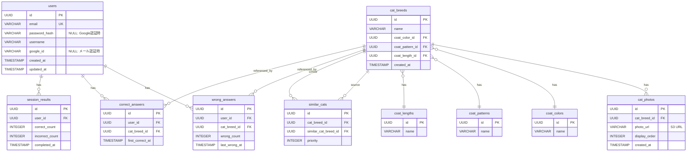

# DB 設計書

## 概要

| 項目 | 内容 |
|------|------|
| プロジェクト | 猫の種類学習アプリ |
| DBエンジン | AWS RDS PostgreSQL |
| 認証方式 | 自前 JWT（httpOnly Cookie）+ Google OAuth 2.0 |
| ファイルストレージ | AWS S3（猫写真）→ DB には URL のみ保持 |
| Read Replica | なし（正規化優先） |
| 設計方針 | UUID 型主キー・created_at / updated_at 標準装備 |

---

## テーブル一覧

| # | テーブル名 | 説明 | 種別 |
|---|-----------|------|------|
| 1 | users | ユーザー情報・認証情報 | トランザクション |
| 2 | cat_breeds | 猫の種類（マスター） | マスター |
| 3 | cat_photos | 猫の写真（S3 URL） | マスター |
| 4 | coat_colors | 毛色マスター | マスター |
| 5 | coat_patterns | 模様マスター | マスター |
| 6 | coat_lengths | 毛の長さマスター | マスター |
| 7 | similar_cats | 類似猫の対応関係 | マスター |
| 8 | wrong_answers | 誤答履歴（ユーザーごと） | トランザクション |
| 9 | correct_answers | 正解履歴（ユーザーごと・ユニーク） | トランザクション |
| 10 | session_results | セッション結果（10問完了記録） | トランザクション |

---

## ER 図



---

## テーブル詳細

### users（ユーザー）

| カラム名 | 型 | 制約 | 説明 |
|---------|-----|------|------|
| id | UUID | PK, DEFAULT gen_random_uuid() | ユーザーID |
| email | VARCHAR(255) | NOT NULL, UNIQUE | メールアドレス |
| password_hash | VARCHAR(255) | NULL | bcrypt ハッシュ（Google認証時はNULL） |
| username | VARCHAR(50) | NOT NULL | 表示名（2〜20文字） |
| google_id | VARCHAR(255) | NULL, UNIQUE | Google OAuth の sub（メール認証時はNULL） |
| created_at | TIMESTAMP WITH TIME ZONE | NOT NULL, DEFAULT NOW() | 作成日時 |
| updated_at | TIMESTAMP WITH TIME ZONE | NOT NULL, DEFAULT NOW() | 更新日時 |

**制約・補足**
- `email` は UNIQUE → 同一メールの重複登録を防止
- `google_id` は UNIQUE → 同一Googleアカウントの重複登録を防止
- `password_hash` と `google_id` はどちらか一方が必ず非NULLになる（アプリ層でバリデーション）

**インデックス**
```sql
CREATE UNIQUE INDEX idx_users_email ON users(email);
CREATE UNIQUE INDEX idx_users_google_id ON users(google_id) WHERE google_id IS NOT NULL;
```

---

### coat_colors（毛色マスター）

| カラム名 | 型 | 制約 | 説明 |
|---------|-----|------|------|
| id | UUID | PK, DEFAULT gen_random_uuid() | 毛色ID |
| name | VARCHAR(50) | NOT NULL | 毛色名（例：白、黒、茶など） |

**シードデータ例**：白、黒、グレー、茶、クリーム、オレンジ、ブルー、チョコレート、ライラック、シルバー

---

### coat_patterns（模様マスター）

| カラム名 | 型 | 制約 | 説明 |
|---------|-----|------|------|
| id | UUID | PK, DEFAULT gen_random_uuid() | 模様ID |
| name | VARCHAR(50) | NOT NULL | 模様名（例：単色、トラ、ぶち、ポイントなど） |

**シードデータ例**：単色（ソリッド）、タビー（縞）、バイカラー（ぶち）、カラーポイント、キャリコ（三毛）、トーティ（べっ甲）

---

### coat_lengths（毛の長さマスター）

| カラム名 | 型 | 制約 | 説明 |
|---------|-----|------|------|
| id | UUID | PK, DEFAULT gen_random_uuid() | 毛の長さID |
| name | VARCHAR(50) | NOT NULL | 毛の長さ名（短毛・長毛） |

**シードデータ例**：短毛、長毛

---

### cat_breeds（猫種）

| カラム名 | 型 | 制約 | 説明 |
|---------|-----|------|------|
| id | UUID | PK, DEFAULT gen_random_uuid() | 猫種ID |
| name | VARCHAR(100) | NOT NULL | 種類名（例：アメリカンショートヘア） |
| coat_color_id | UUID | NOT NULL, FK → coat_colors(id) | 毛色（代表色） |
| coat_pattern_id | UUID | NOT NULL, FK → coat_patterns(id) | 模様（代表パターン） |
| coat_length_id | UUID | NOT NULL, FK → coat_lengths(id) | 毛の長さ |
| created_at | TIMESTAMP WITH TIME ZONE | NOT NULL, DEFAULT NOW() | 作成日時 |

**補足**
- シードデータとして初期投入（実データは実装フェーズで作成）
- 毛色・模様・毛の長さは「代表的な特徴」を1つ選択（マルチカラーは別設計になる場合は将来拡張）

**インデックス**
```sql
CREATE INDEX idx_cat_breeds_coat_color ON cat_breeds(coat_color_id);
CREATE INDEX idx_cat_breeds_coat_pattern ON cat_breeds(coat_pattern_id);
CREATE INDEX idx_cat_breeds_coat_length ON cat_breeds(coat_length_id);
```

---

### cat_photos（猫写真）

| カラム名 | 型 | 制約 | 説明 |
|---------|-----|------|------|
| id | UUID | PK, DEFAULT gen_random_uuid() | 写真ID |
| cat_breed_id | UUID | NOT NULL, FK → cat_breeds(id) | 対応する猫種 |
| photo_url | VARCHAR(500) | NOT NULL | S3 に保存された写真の URL |
| display_order | INTEGER | NOT NULL | カルーセルの表示順（昇順） |
| created_at | TIMESTAMP WITH TIME ZONE | NOT NULL, DEFAULT NOW() | 作成日時 |

**補足**
- 写真の実体は S3 に保存。DB には CloudFront 経由の URL を保持
- `display_order` が小さいほど先に表示。クイズでは代表写真（display_order = 1）を使用

**インデックス**
```sql
CREATE INDEX idx_cat_photos_breed ON cat_photos(cat_breed_id, display_order);
```

---

### similar_cats（類似猫）

| カラム名 | 型 | 制約 | 説明 |
|---------|-----|------|------|
| id | UUID | PK, DEFAULT gen_random_uuid() | レコードID |
| cat_breed_id | UUID | NOT NULL, FK → cat_breeds(id) | 基準となる猫種 |
| similar_cat_breed_id | UUID | NOT NULL, FK → cat_breeds(id) | 似ている猫種 |
| priority | INTEGER | NOT NULL, DEFAULT 0 | 表示優先度（大きいほど優先） |

**制約**
```sql
UNIQUE(cat_breed_id, similar_cat_breed_id)
CHECK (cat_breed_id <> similar_cat_breed_id)
```

**補足**
- 手動登録データを `priority` で優先表示（優先度 > 0 が手動登録）
- 毛色・模様・毛の長さが1つ以上一致する猫は自動抽出（`priority = 0`）でロジック側で計算
- 解説画面で最大3件を表示

**インデックス**
```sql
CREATE INDEX idx_similar_cats_breed ON similar_cats(cat_breed_id, priority DESC);
```

---

### wrong_answers（誤答履歴）

| カラム名 | 型 | 制約 | 説明 |
|---------|-----|------|------|
| id | UUID | PK, DEFAULT gen_random_uuid() | 誤答ID |
| user_id | UUID | NOT NULL, FK → users(id) ON DELETE CASCADE | ユーザー |
| cat_breed_id | UUID | NOT NULL, FK → cat_breeds(id) | 間違えた猫種 |
| wrong_count | INTEGER | NOT NULL, DEFAULT 1, CHECK >= 1 | 誤答累計回数 |
| last_wrong_at | TIMESTAMP WITH TIME ZONE | NOT NULL | 最終誤答日時 |

**制約**
```sql
UNIQUE(user_id, cat_breed_id)
```

**補足**
- ユニーク制約により、同じユーザー×猫種の組み合わせは1レコード
- 再度間違えた場合は `wrong_count += 1`, `last_wrong_at` を更新（UPSERT）
- 誤答履歴はリセットなし・累積
- クイズ出題時に `wrong_count` を重みとして使用（多いほど優先出題）

**インデックス**
```sql
CREATE INDEX idx_wrong_answers_user ON wrong_answers(user_id, wrong_count DESC, last_wrong_at DESC);
```

---

### correct_answers（正解履歴）

| カラム名 | 型 | 制約 | 説明 |
|---------|-----|------|------|
| id | UUID | PK, DEFAULT gen_random_uuid() | 正解ID |
| user_id | UUID | NOT NULL, FK → users(id) ON DELETE CASCADE | ユーザー |
| cat_breed_id | UUID | NOT NULL, FK → cat_breeds(id) | 正解した猫種 |
| first_correct_at | TIMESTAMP WITH TIME ZONE | NOT NULL | 初回正解日時 |

**制約**
```sql
UNIQUE(user_id, cat_breed_id)
```

**補足**
- ユニーク制約により、同じユーザー×猫種の組み合わせは1レコード（初回正解のみ記録）
- 結果画面の「累計覚えた種類数」は `COUNT(*)` で取得

**インデックス**
```sql
CREATE INDEX idx_correct_answers_user ON correct_answers(user_id);
```

---

### session_results（セッション結果）

| カラム名 | 型 | 制約 | 説明 |
|---------|-----|------|------|
| id | UUID | PK, DEFAULT gen_random_uuid() | セッションID |
| user_id | UUID | NOT NULL, FK → users(id) ON DELETE CASCADE | ユーザー |
| correct_count | INTEGER | NOT NULL, CHECK >= 0 | セッション内の正解数 |
| incorrect_count | INTEGER | NOT NULL, CHECK >= 0 | セッション内の不正解数 |
| completed_at | TIMESTAMP WITH TIME ZONE | NOT NULL, DEFAULT NOW() | セッション完了日時 |

**補足**
- 10問完了時（「次の問題へ」を10回押した後）に1レコード挿入
- 正答率の計算 = `correct_count / (correct_count + incorrect_count)`
- 今日の一匹のセッションも同テーブルで管理（問題数が1問）

**インデックス**
```sql
CREATE INDEX idx_session_results_user ON session_results(user_id, completed_at DESC);
```

---

## 正規化の検討

| 項目 | 方針 | 理由 |
|------|------|------|
| 毛色・模様・毛の長さ | マスターテーブル分離 | フィルタリング機能・解説での共通表示に活用 |
| 類似猫の対称性 | 双方向で登録 | A→B、B→A をそれぞれレコードとして持つ（アプリ層で対称挿入） |
| 誤答・正解の集計 | 非正規化しない | DAU 1,000・ピーク50 RPS では集計クエリで十分対応可能 |
| 猫写真URL | S3 URL のみ保持 | S3/CloudFront 利用のためファイル実体はDBに持たない |

---

## マイグレーション実行順序

```
1. coat_colors
2. coat_patterns
3. coat_lengths
4. cat_breeds（coat_* に依存）
5. cat_photos（cat_breeds に依存）
6. similar_cats（cat_breeds に依存）
7. users
8. wrong_answers（users, cat_breeds に依存）
9. correct_answers（users, cat_breeds に依存）
10. session_results（users に依存）
```

---

## シードデータ方針

| テーブル | 方針 |
|---------|------|
| coat_colors | 実装フェーズで初期データ投入 |
| coat_patterns | 実装フェーズで初期データ投入 |
| coat_lengths | 「短毛」「長毛」の2件 |
| cat_breeds | CFA 基準の猫種を実装フェーズで投入 |
| cat_photos | 各猫種3〜5枚を S3 にアップロード後、URL を投入 |
| similar_cats | 手動登録分は実装フェーズで投入、自動抽出はロジックで処理 |
