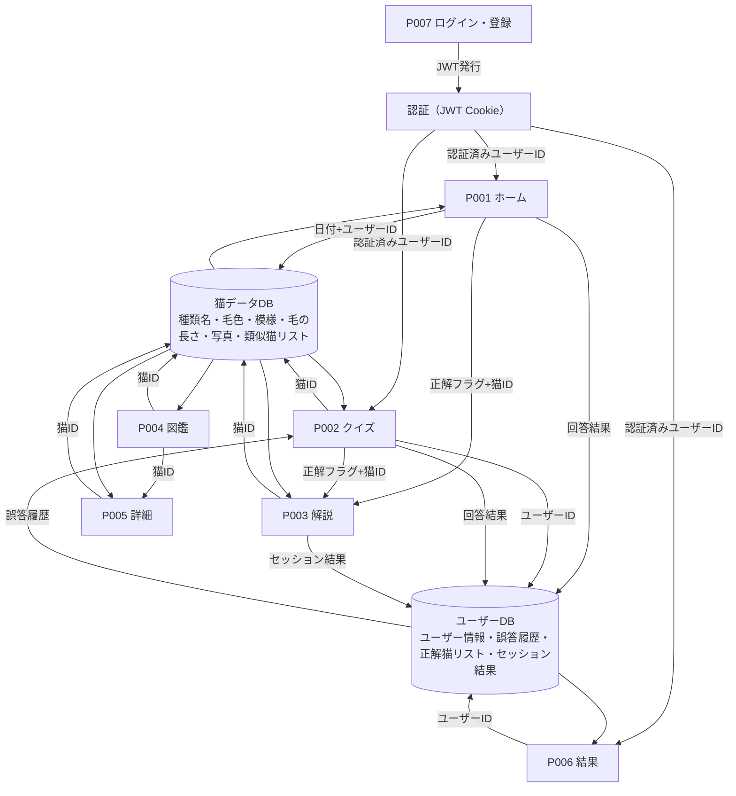

# Input / Process / Output 一覧

> 全機能のデータの流れと処理の内容が網羅される

## IPO 一覧

| # | 機能 | Page | Input | Process | Output |
|---|------|------|-------|---------|--------|
| 1 | メール＋パスワードログイン | P007 ログイン・登録 | メールアドレス・パスワード | バックエンドで認証。JWT を httpOnly Cookie に発行 | P001（ホーム画面）へ遷移 |
| 2 | Google ログイン | P007 ログイン・登録 | Google OAuth 認可コード | Google API で認証・ユーザー情報取得。JWT を httpOnly Cookie に発行 | P001（ホーム画面）へ遷移 |
| 3 | 新規登録 | P007 ログイン・登録 | メールアドレス・パスワード・ユーザー名 | メール重複チェック。パスワードをハッシュ化して保存。JWT を httpOnly Cookie に発行 | P001（ホーム画面）へ遷移 |
| 4 | クイズ開始 | P001 ホーム | 「クイズを始める」ボタンクリック・認証済みユーザーID | セッション状態を初期化 | P002（クイズ画面）へ遷移 |
| 5 | 今日の一匹（出題） | P001 ホーム | 現在日付・認証済みユーザーID | 日付＋ユーザーIDをシードにランダム猫を1種選択。同日中は同じ猫を返す | 猫の写真＋4択クイズを表示 |
| 6 | 今日の一匹（回答） | P001 ホーム | ユーザーの選択肢クリック・認証済みユーザーID | 正解判定。回答結果をDBに保存 | P003（解説画面）へ遷移 |
| 7 | 出題（写真→種類名） | P002 クイズ | セッション開始・問題番号・認証済みユーザーID | ユーザーの誤答履歴をDBから取得し優先猫を決定。写真＋正解1＋不正解3をランダム選択 | 猫の写真＋4つの種類名選択肢を表示 |
| 8 | 出題（種類名→写真） | P002 クイズ | セッション開始・問題番号・認証済みユーザーID | ユーザーの誤答履歴をDBから取得し優先猫を決定。種類名＋正解写真1＋不正解写真3をランダム選択 | 種類名テキスト＋4つの猫写真選択肢を表示 |
| 9 | 回答選択 | P002 クイズ | ユーザーの選択肢クリック・認証済みユーザーID | 正解判定。不正解の場合は誤答履歴をDBに保存。正解の場合は正解猫IDをDBに保存 | P003（解説画面）へ遷移。正解フラグ＋猫IDを渡す |
| 10 | 進捗表示 | P002 クイズ | 現在の問題番号 | カウンターをインクリメント | 問題番号表示を更新（例：3/10） |
| 11 | 正解・不正解表示 | P003 解説 | 直前クイズの正解フラグ | フラグを評価 | 正解バナー（緑）または不正解バナー（赤）を表示 |
| 12 | 猫の特徴表示 | P003 解説 | 正解の猫ID | 猫IDをキーに猫データ（写真・種類名・毛色・模様・毛の長さ）を取得 | 猫の写真・種類名・特徴リストを表示 |
| 13 | 似た種類表示 | P003 解説 | 正解の猫ID | 手動登録の類似猫リスト＋毛色・模様・毛の長さが1つ以上一致する猫を自動抽出（手動優先）。最大3件 | 似た猫の種類名＋写真を表示 |
| 14 | 次の問題へ | P003 解説 | 「次の問題へ」ボタンクリック・問題番号・認証済みユーザーID | 問題番号が10未満 → 次の問題へ。10問完了 → セッション結果をDBに保存 | P002（クイズ画面）または P006（結果画面）へ遷移 |
| 15 | 猫種一覧表示 | P004 図鑑 | 画面表示イベント | 全猫種データを取得 | リスト形式（名前＋サムネイル写真）で全件表示 |
| 16 | フィルタリング | P004 図鑑 | 毛色・模様・毛の長さのドロップダウン選択値（各任意） | 選択された条件をANDで組み合わせて猫種データを絞り込む。未選択条件は無視 | 絞り込み結果のリストをリアルタイム更新 |
| 17 | 詳細表示（図鑑→詳細） | P004 図鑑 | 猫リストアイテムのクリック・選択猫ID | 選択猫IDを遷移先に渡す | P005（猫詳細画面）へ遷移 |
| 18 | 写真切り替え | P005 詳細 | 遷移時の猫ID・矢印ボタンクリック | 猫IDをキーに複数枚の写真URLリストを取得。矢印クリックで表示インデックスを更新 | 写真カルーセルを表示・切り替え |
| 19 | 特徴表示 | P005 詳細 | 遷移時の猫ID | 猫IDをキーに種類名・毛色・模様・毛の長さを取得 | 種類名・特徴リストを表示 |
| 20 | 結果表示 | P006 結果 | セッションの正解数・不正解数 | 正解数 / 10 で正答率を計算 | 正答率・正解数・不正解数を表示 |
| 21 | 累計表示 | P006 結果 | 認証済みユーザーID | DBからユーザーの正解猫IDリストを取得。ユニーク数をカウント | 累計覚えた種類数を表示 |
| 22 | もう一度挑戦 | P006 結果 | 「もう一度挑戦」ボタンクリック | - | P001（ホーム画面）へ遷移 |

## データフロー図

## 注記

- **認証**: JWT（httpOnly Cookie）で管理。未認証時はP007へリダイレクト
- **ユーザーDB 保存データ**:
  - `wrong_answers`: 誤答猫IDリスト（優先出題に使用）
  - `correct_cats`: 正解した猫IDの重複なしリスト（累計表示に使用）
  - `session_results`: セッション履歴（正解数・不正解数・日時）
- **猫データDB**: バックエンドAPIから取得（静的データのため CDN キャッシュ可）
