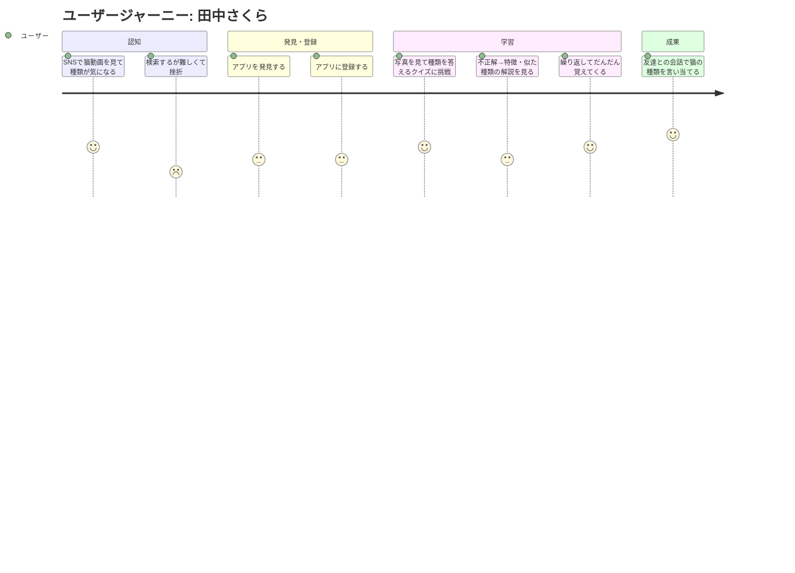

# ユーザージャーニー

## ペルソナ

| 項目 | 内容 |
|-----|------|
| ペルソナ | 田中さくら |
| ユーザー像 | 20代会社員。猫の写真・動画が好きで SNS をよく見る。猫好きの友達との会話で種類の話についていきたい。 |
| 課題 | 名前を聞いても見た目が思い浮かばない。写真を見てもどう表現すればいいかわからず調べにくい。 |
| 利用シーン | SNS を見ながら、週に数回、5分程度 |

## ジャーニーマップ

## メインフロー

| # | フェーズ | 行動 | 課題・感情 | 解決 |
|---|---------|------|----------|------|
| 1 | 認知 | SNS で猫動画を見て種類が気になる | 楽しいが、調べようとすると難しくて挫折 😞 | クイズ形式で気軽に学べるアプリを発見 |
| 2 | 発見・登録 | アプリを発見し、登録する | 「どんなものか」半信半疑 🤔 | シンプルな登録フローでスムーズに開始 |
| 3 | 学習 | 写真を見て種類を答えるクイズに挑戦 | 楽しい！でも不正解が悔しい 😤 | 不正解後に写真・毛色・模様・毛の長さの特徴と似た種類を解説表示 |
| 4 | 定着 | 繰り返しクイズをこなして覚えてくる | だんだん答えられて嬉しい 😊 | 短時間（5分）で完結するセッション設計 |
| 5 | 成果 | 友達との会話で猫の種類を言い当てる | スッキリ！自信がついた ✨ | 覚えた種類数・正答率などの進捗が確認できる |

## 感情の変化

- **開始時**: SNS で猫動画を見て楽しい気持ち
- **最初のつまずき**: 検索しても難しくて情報が多すぎて挫折・モヤモヤ
- **ブレークスルー**: クイズで不正解でも解説で「なるほど！」とわかる瞬間
- **ゴール達成時**: 友達との会話で種類を言い当てられてスッキリ・自信がつく
