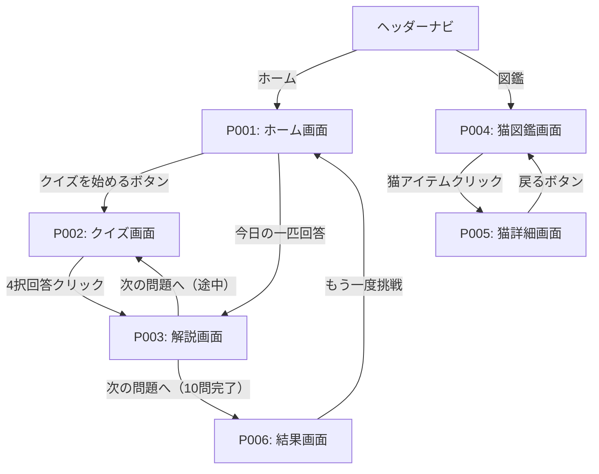

# 画面フロー・遷移図

## 概要

| 項目 | 内容 |
|------|------|
| プロジェクト | 猫の種類学習アプリ |
| Sprint | Sprint 3 |
| 作成日 | 2026-03-03 |
| プラットフォーム | Webアプリ（Next.js 15 / PC・スマホブラウザ対応） |

## ページリスト（確定版）

| ページID | ページ名 | 説明 |
|---------|---------|------|
| P001 | ホーム画面 | クイズ開始・今日の一匹（クイズ形式） |
| P002 | クイズ画面 | 猫の写真/名前を4択で回答（10問/セッション） |
| P003 | 解説画面 | 回答後の猫の特徴・似た種類の表示 |
| P004 | 猫図鑑画面 | 全猫種一覧・フィルタリング |
| P005 | 猫詳細画面 | 猫の写真（複数枚）・特徴の詳細表示 |
| P006 | 結果画面 | 10問完了後の正答率・覚えた種類数の表示 |
| P007 | ログイン・登録画面 | メール＋パスワード / Google OAuth でログイン・新規登録 |

## 共通UI

| 要素 | 説明 |
|------|------|
| ヘッダーナビゲーション | 「ホーム」「図鑑」の2メニュー。全ページ共通で表示 |

## ページ関係表

| ページ名 | 説明 | 遷移元 | 遷移先 | 遷移トリガー |
|--------|------|--------|--------|------------|
| ホーム画面 | アプリのエントリーポイント | - / ヘッダー | P002, P003 | 「クイズを始める」ボタン / 今日の一匹回答 |
| クイズ画面 | メイン学習画面 | P001 | P003 | 4択回答クリック |
| 解説画面 | 回答後の解説表示 | P001, P002 | P002, P006 | 「次の問題へ」ボタン（10問完了後はP006へ） |
| 猫図鑑画面 | 全猫種一覧・絞り込み | ヘッダー | P005 | 猫リストアイテムのクリック |
| 猫詳細画面 | 猫の詳細情報 | P004 | P004 | 「戻る」ボタン |
| 結果画面 | 10問完了後の結果表示 | P003 | P001 | 「もう一度挑戦」ボタン |

## ページ遷移図

## 補足

- 各Pageの詳細仕様は `specifications/{page-name}.md` を参照
- 認証: メール＋パスワード / Google OAuth（JWT・httpOnly Cookie）
- 誤答履歴・正解猫リスト・セッション結果はサーバー側DBにユーザーごとに保存
- 誤答履歴はリセットなし・ずっと蓄積
- 間違えた問題を優先して出題するロジックはP002（クイズ画面）で実装
- 未認証時はP007（ログイン・登録画面）へリダイレクト
